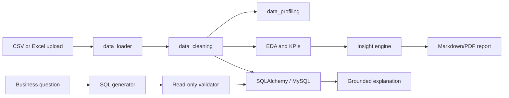

# Architecture

The LLM is an optional interpretation layer. Numeric findings are computed by Python or validated SQL before explanation. SQL mutation is blocked by the validator and database access is intended to use a read-only MySQL account.
